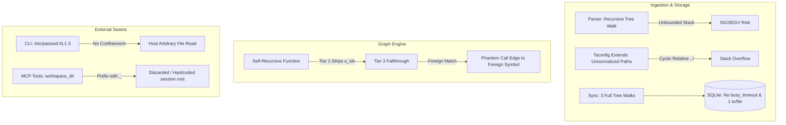

# Master Architectural Audit Report: mimori

**Audit Date**: 2026-09-21  
**Target Repository**: `fusuyfusuy/mimori`  
**Evaluation Protocol**: Boundary-Review Protocol (Standardized Rubric)  
**Status**: **CRITICAL** (Requires Operator Approval Prior to Remediation)

---

## 1. Executive Scorecard

| Scope | Subsystem Boundary | Health Score | Status | Critical Findings | Invariant Breaches | Link to Scope Report |
|---|---|:---:|:---:|:---:|:---:|---|
| **Scope 1** | Parsers & Models (AST Ingestion) | **6.8** | `CRITICAL` | 5 | 0 | [.agents/reviews/scope_1_parsers_models.md](file:///home/devhax/projects/fusuyfusuy/mimori/.agents/reviews/scope_1_parsers_models.md) |
| **Scope 2** | Graph Engine & Structural Analysis | **8.2** | `MODERATE` | 1 | 0 | [.agents/reviews/scope_2_graph.md](file:///home/devhax/projects/fusuyfusuy/mimori/.agents/reviews/scope_2_graph.md) |
| **Scope 3** | Storage, Workspace & Cache Engine | **6.8** | `CRITICAL` | 3 | 1 | [.agents/reviews/scope_3_storage_workspace.md](file:///home/devhax/projects/fusuyfusuy/mimori/.agents/reviews/scope_3_storage_workspace.md) |
| **Scope 4** | Project Memory & Ponytail Debt Engine | **7.2** | `MODERATE` | 3 | 3 | [.agents/reviews/scope_4_memory_debt.md](file:///home/devhax/projects/fusuyfusuy/mimori/.agents/reviews/scope_4_memory_debt.md) |
| **Scope 5** | External Interfaces (CLI & MCP Server) | **7.9** | `MODERATE` | 1 | 1 | [.agents/reviews/scope_5_interfaces.md](file:///home/devhax/projects/fusuyfusuy/mimori/.agents/reviews/scope_5_interfaces.md) |
| **Seams** | Cross-Boundary Seams & Contracts | **6.8** | `CRITICAL` | 8 Divergences | 1 | [.agents/reviews/scope_seams.md](file:///home/devhax/projects/fusuyfusuy/mimori/.agents/reviews/scope_seams.md) |
| **COMPOSITE** | **Repository Whole** | **7.28** | `CRITICAL` | **13 Critical Issues** | **6 Invariant Breaches** | — |

---

## 2. Invariant & Contract Breaches

1. **Architecture Invariant 3: Workspace Confinement Breach**
   - **Locations**: [`src/main.rs:31-32`](file:///home/devhax/projects/fusuyfusuy/mimori/src/main.rs#L31-L32), [`src/workspace/aliases.rs:408-454`](file:///home/devhax/projects/fusuyfusuy/mimori/src/workspace/aliases.rs#L408-L454)
   - **Breach Details**: While MCP enforces `confine(&session.root, &full)`, CLI slicing executes without workspace checks (`mimori slice /etc/passwd:#L1-3` succeeds). Furthermore, `aliases.rs` resolves `extends`, `references`, and workspace globs across arbitrary filesystem paths outside the repository root.
2. **Architecture Invariant 2: Deterministic & Non-Interactive Structured Output Breach**
   - **Location**: [`src/main.rs:561-572, 594-604`](file:///home/devhax/projects/fusuyfusuy/mimori/src/main.rs#L561-L572)
   - **Breach Details**: Supplying `--section` to `mimori --json memory` or `mimori --json memory show` bypasses JSON serialization and emits unformatted markdown text or `MEM_EMPTY: ...` to stdout.
3. **Data Preservation Invariant: Silent Purge of Manual Technical Debt**
   - **Location**: [`src/memory/debt.rs:324-331`](file:///home/devhax/projects/fusuyfusuy/mimori/src/memory/debt.rs#L324-L331)
   - **Breach Details**: Running `sync_debt` retains manual debt only if `item.is_accepted` is true (`what` starts with `"accepted"`). Valid manual debt entries conforming to standard syntax lacking this exact keyword are silently wiped from `.agents/memory.md`.
4. **Code-to-Ledger Parity Breach: Zero Untracked Debt Invariant**
   - **Location**: [`src/memory/debt.rs:262-310`](file:///home/devhax/projects/fusuyfusuy/mimori/src/memory/debt.rs#L262-L310)
   - **Breach Details**: `check_debt` and `lint` do not verify that in-code ponytail markers match entries in `.agents/memory.md`. Markers can be committed to source code without ever syncing to project memory while CI remains green.
5. **Persistence Safety: Non-Atomic File Writes & Concurrency Race**
   - **Locations**: [`src/memory/ledger.rs:218-222`](file:///home/devhax/projects/fusuyfusuy/mimori/src/memory/ledger.rs#L218-L222), [`src/memory/debt.rs:351-354`](file:///home/devhax/projects/fusuyfusuy/mimori/src/memory/debt.rs#L351-L354)
   - **Breach Details**: Mutations to `.agents/memory.md` execute via bare `fs::write` without advisory file locking (`flock`) or atomic write-and-rename, risking torn files during concurrent agent runs.
6. **MCP Stdio Protocol Invariant: Request Cancellation Race & Monotonic Leak**
   - **Locations**: [`src/mcp/mod.rs:46, 68, 98`](file:///home/devhax/projects/fusuyfusuy/mimori/src/mcp/mod.rs#L46), [`tests/cli_mcp.rs:818-840`](file:///home/devhax/projects/fusuyfusuy/mimori/tests/cli_mcp.rs#L818-L840)
   - **Breach Details**: Causes the failing integration test in `cargo test --test cli_mcp` (`test_mcp_whole_session_stdout_purity`). Rapid request execution completes before the background reader thread registers cancellation, emitting an uncancelled response to stdout. Late cancellations monotonically leak memory in `cancelled_ids`.

---

## 3. Top Architectural & Structural Defects

### Critical Findings Summary
- **CRITICAL-1: Stack Overflow on Cross-Directory `tsconfig.json` Cycles** ([`src/workspace/aliases.rs:339-342, 408-430`](file:///home/devhax/projects/fusuyfusuy/mimori/src/workspace/aliases.rs#L339-L342)): Cycle detection via `HashSet<PathBuf>` lacks path canonicalization. Mutual `extends` across relative directories expands paths infinitely (`a/../b/../a/...`), triggering stack exhaustion.
- **CRITICAL-2: Recursive Self-Call Cross-Wiring via Tier 3 Fallthrough** ([`src/graph/mod.rs:201-225, 291-306`](file:///home/devhax/projects/fusuyfusuy/mimori/src/graph/mod.rs#L201-L225)): In `SymbolGraph::new`, self-recursive functions strip their own index in Tier 1 (`v != u_idx`). If another file defines a callable with the same name, Tier 3 links a call edge from the function to the foreign file, corrupting PageRank and blast radiuses.
- **CRITICAL-3: SQLite Lock Contention Under WAL** ([`src/storage/db.rs:27-32`](file:///home/devhax/projects/fusuyfusuy/mimori/src/storage/db.rs#L27-L32)): WAL mode is configured with 0ms `busy_timeout`. Any simultaneous CLI and MCP commands crash immediately with `database is locked`.
- **CRITICAL-4: AST Extraction Correctness Failures**:
  - **Go Grouped Types** ([`src/parser/go.rs:62`](file:///home/devhax/projects/fusuyfusuy/mimori/src/parser/go.rs#L62)): Passes outer `type_declaration` instead of child `type_spec`, corrupting symbol boundaries for all grouped types.
  - **Python Typed Signatures** ([`src/parser/python.rs:170`](file:///home/devhax/projects/fusuyfusuy/mimori/src/parser/python.rs#L170)): Slices signatures at `body.find(':')`, truncating parameters and return types for any typed Python function.
  - **Python Decorators** ([`src/parser/python.rs:68-73`](file:///home/devhax/projects/fusuyfusuy/mimori/src/parser/python.rs#L68-L73)): Strips `@decorator` annotations from symbol spans.
  - **Windows Drive Letters** ([`src/model/coordinate.rs:51-62`](file:///home/devhax/projects/fusuyfusuy/mimori/src/model/coordinate.rs#L51-L62)): `C:\path:symbol` splits on the drive colon, failing coordinate parsing.
- **CRITICAL-5: Discarded `workspace_dir` Parameter in MCP Engine** ([`src/mcp/tools.rs:432, 511, 558`](file:///home/devhax/projects/fusuyfusuy/mimori/src/mcp/tools.rs#L432)): `mimori_slice`, `mimori_blast`, and `mimori_graph` declare and validate `workspace_dir` into `_scope_dir`, but discard it and execute on `session.root`.

---

## 4. Prioritized Remediation Roadmap

### Priority 1: Security & Crash Vulnerabilities (P1)
1. **Enforce CLI Workspace Confinement**: Validate coordinate paths in [`src/main.rs:31-32, 754`](file:///home/devhax/projects/fusuyfusuy/mimori/src/main.rs#L31-L32) against workspace root before reading lines or discovering roots.
2. **Canonicalize Tsconfig Paths in Cycle Detection**: Normalize or canonicalize `PathBuf` in [`src/workspace/aliases.rs:339-342, 408-430`](file:///home/devhax/projects/fusuyfusuy/mimori/src/workspace/aliases.rs#L339-L342) before inserting into `visited`; reject `extends` and `references` that escape `root`.
3. **Set SQLite Busy Timeout**: Add `PRAGMA busy_timeout = 5000;` or `conn.busy_timeout(Duration::from_millis(5000))` in [`src/storage/db.rs:27-32`](file:///home/devhax/projects/fusuyfusuy/mimori/src/storage/db.rs#L27-L32).
4. **Guard Tree-Sitter AST Traversal Depth**: Convert recursive AST walking across [`src/parser/*.rs`](file:///home/devhax/projects/fusuyfusuy/mimori/src/parser/) to iterative worklists with a maximum depth cap (e.g. 256) to prevent thread stack exhaustion.

### Priority 2: Invariants & Core Correctness (P2)
1. **Prevent Silent Deletion of Manual Debt in `sync_debt`**: Remove `item.is_accepted` filtering in [`src/memory/debt.rs:324-331`](file:///home/devhax/projects/fusuyfusuy/mimori/src/memory/debt.rs#L324-L331) to preserve all valid manual debt items.
2. **Atomic Writes & Advisory Locking for `memory.md`**: Implement `named_tempfile` and atomic rename with advisory file locking in [`src/memory/ledger.rs:218`](file:///home/devhax/projects/fusuyfusuy/mimori/src/memory/ledger.rs#L218) and [`src/memory/debt.rs:351`](file:///home/devhax/projects/fusuyfusuy/mimori/src/memory/debt.rs#L351).
3. **Fix Self-Recursive Edge Disambiguation**: In [`src/graph/mod.rs:201-225`](file:///home/devhax/projects/fusuyfusuy/mimori/src/graph/mod.rs#L201-L225), recognize self-calls in Tier 1 rather than stripping them and falling through to Tier 3 foreign matches.
4. **Fix CLI `--json` Contract on Memory Commands**: Ensure [`src/main.rs:561-572, 594-604`](file:///home/devhax/projects/fusuyfusuy/mimori/src/main.rs#L561-L572) emits structured JSON when `--json` is specified with `--section`.
5. **Resolve MCP Cancellation Race & Failing Integration Test**: In [`src/mcp/mod.rs:46-113`](file:///home/devhax/projects/fusuyfusuy/mimori/src/mcp/mod.rs#L46-L113), serialize cancellations through the request queue or bound `cancelled_ids`, and adjust [`tests/cli_mcp.rs:818-840`](file:///home/devhax/projects/fusuyfusuy/mimori/tests/cli_mcp.rs#L818-L840) to conform to asynchronous cancellation semantics.
6. **Correct AST Parser Extraction Bugs**:
   - Go: Pass child `type_spec` in [`src/parser/go.rs:62`](file:///home/devhax/projects/fusuyfusuy/mimori/src/parser/go.rs#L62).
   - Python: AST-based signature extraction in [`src/parser/python.rs:170`](file:///home/devhax/projects/fusuyfusuy/mimori/src/parser/python.rs#L170).
   - Python: Include decorator nodes in [`src/parser/python.rs:68-73`](file:///home/devhax/projects/fusuyfusuy/mimori/src/parser/python.rs#L68-L73).
   - Windows: Handle drive prefix (`[A-Za-z]:[\\/]`) in [`src/model/coordinate.rs:51-62`](file:///home/devhax/projects/fusuyfusuy/mimori/src/model/coordinate.rs#L51-L62).
7. **Plumb `workspace_dir` in MCP Handlers**: Pass `_scope_dir` into graph and slice functions in [`src/mcp/tools.rs:432, 511, 558`](file:///home/devhax/projects/fusuyfusuy/mimori/src/mcp/tools.rs#L432).

### Priority 3: Performance & Hygiene (P3)
1. **Batch SQLite File Indexing**: Wrap file insertions and deletions in [`src/storage/sync.rs:68-83`](file:///home/devhax/projects/fusuyfusuy/mimori/src/storage/sync.rs#L68-L83) in a single SQLite transaction.
2. **Consolidate Discovery Walks**: Unify manifest, tsconfig, and source file discovery into a single `WalkBuilder` pass in [`src/storage/sync.rs:24-26`](file:///home/devhax/projects/fusuyfusuy/mimori/src/storage/sync.rs#L24-L26).
3. **Precompute PageRank Transition Weights**: Replace in-loop `HashMap<(usize, usize), f64>` queries in [`src/graph/pagerank.rs:96-101`](file:///home/devhax/projects/fusuyfusuy/mimori/src/graph/pagerank.rs#L96-L101) with precomputed CSR/adjacency vectors.
4. **Eliminate Parser Membership String Allocations**: Replace `.contains(&name.to_string())` with `calls.iter().any(|c| c == name)` in [`src/parser/*.rs`](file:///home/devhax/projects/fusuyfusuy/mimori/src/parser/).
5. **Populate or Prune SQLite `symbols.centrality`**: Either update SQLite with computed PageRank or drop the unpopulated column and index in [`src/storage/db.rs:49, 60`](file:///home/devhax/projects/fusuyfusuy/mimori/src/storage/db.rs#L49-L60).
6. **Include Active Epics & Strip Emojis in Turn-0 Dump**: Inject `l.epics` and strip decorative emojis in [`src/memory/dump.rs:26-59`](file:///home/devhax/projects/fusuyfusuy/mimori/src/memory/dump.rs#L26-L59).

---

## 5. Approval Gate
> [!IMPORTANT]
> **Diagnostic Mode Active**: In strict adherence to the Boundary-Review protocol, **no code has been modified**.
> Awaiting operator confirmation to proceed with remediation.
